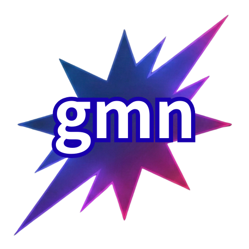

<p align="center">
  
</p>

<p align="center">
  
  
</p>

<p align="center">
  <strong>FoxRay</strong><br>
  <em>Go で書かれた軽量・非対話型の Gemini CLI フォーク</em>
</p>

<p align="center">
  <a href="README.md">English</a>
</p>

## FoxRay とは

FoxRay は `gmn-api` をベースに、独立して管理しやすいように再命名したフォークです。高速な Go 製 CLI、Gemini API / Vertex AI Express 向けの API キー認証、MCP サポートはそのままに、プロジェクト名と配布名を `FoxRay` に統一しています。

互換性も残しています。

- OAuth と MCP 設定は引き続き `~/.gemini/` を利用
- 既存の `GMN_*` 環境変数も利用可能
- 既存の `~/.gmn/.env` もフォールバックとして読み込み

## インストール

前提条件:

- Go 1.22 以上
- [Google AI Studio](https://aistudio.google.com/apikey) または Google Cloud の API キー

GitHub リポジトリを作成した後は、次のようにインストールできます。

```bash
go install github.com/PinkyFrog0o0/foxray@latest
```

このフォークは GitHub オーナー `PinkyFrog0o0` 向けに設定済みです。

## クイックスタート

```bash
# API キーを直接渡す
foxray "量子コンピューティングについて説明して" -k YOUR_API_KEY

# 新しい環境変数名を使う
export FOXRAY_API_KEY=YOUR_API_KEY
foxray "量子コンピューティングについて説明して"

# 既存の GMN_* も使える
export GMN_API_KEY=YOUR_API_KEY
foxray "量子コンピューティングについて説明して"

# ファイルを含める
foxray "このコードをレビューして" -f main.go

# パイプ入力
cat error.log | foxray "何が問題？"

# JSON 出力
foxray "色を3つ挙げて" -o json

# モデル指定
foxray "詩を書いて" -m gemini-2.5-pro

# Vertex AI Express
foxray "こんにちは" --backend vertex -k YOUR_API_KEY
```

## 認証

FoxRay は 2 つの認証モードに対応しています。

API キーモード:

```bash
foxray "こんにちは" -k YOUR_API_KEY
export FOXRAY_API_KEY=YOUR_API_KEY
foxray "こんにちは"
```

OAuth フォールバック:

API キーがない場合は、公式 Gemini CLI が `~/.gemini/` に保存した認証情報を利用します。

```bash
npm install -g @google/gemini-cli
gemini
foxray "こんにちは"
```

## 環境変数

FoxRay は新しい `FOXRAY_*` を優先し、既存の `GMN_*` をフォールバックとして扱います。

| Primary | Legacy fallback | Flag | Description | Default |
|---------|-----------------|------|-------------|---------|
| `FOXRAY_API_KEY` | `GMN_API_KEY` | `-k, --api-key` | Gemini / Vertex AI の API キー | — |
| `FOXRAY_BACKEND` | `GMN_BACKEND` | `--backend` | API バックエンド (`gemini` / `vertex`) | `gemini` |
| `FOXRAY_MODEL` | `GMN_MODEL` | `-m, --model` | モデル名 | `gemini-2.5-flash` |
| `FOXRAY_API_URL` | `GMN_API_URL` | `--api-url` | カスタム API ベース URL | auto |
| `FOXRAY_LOCATION` | `GMN_LOCATION` | `--location` | Vertex AI リージョン | — |

## .env の読み込み順

FoxRay は次の順序で `.env` を読み込みます。

1. `~/.foxray/.env`
2. `~/.gmn/.env`
3. `./.env`
4. OS 環境変数が最優先

例:

```dotenv
FOXRAY_API_KEY=AIza...
FOXRAY_MODEL=gemini-2.5-pro
FOXRAY_BACKEND=gemini
```

## MCP サポート

FoxRay は `~/.gemini/settings.json` を通じて [Model Context Protocol](https://modelcontextprotocol.io/) サーバーを利用できます。

```json
{
  "mcpServers": {
    "my-server": {
      "command": "/path/to/mcp-server"
    }
  }
}
```

```bash
foxray mcp list
foxray mcp call my-server tool-name arg=value
```

## ビルド

```bash
git clone https://github.com/PinkyFrog0o0/foxray.git
cd FoxRay
make build
make cross-compile
```

## クレジット

FoxRay は次のプロジェクトをベースにした派生物です。

- [gmn-api](https://github.com/hirsaeki/gmn-api)
- [gmn](https://github.com/tomohiro-owada/gmn)
- [Google Gemini CLI](https://github.com/google-gemini/gemini-cli)
